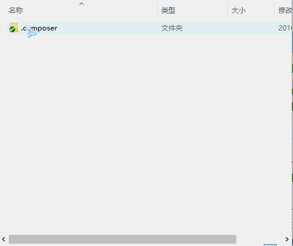

# Composer Hepler
Windows 系统用 bat 脚本，双击即用
### 目录结构
```
项目根目录
    .composer-help
        bat脚本
        ...
    vendor
        依赖库
        ...
    项目代码
    ...
    ...
```

## composer#create
+ 创建新的项目
+ 将下载的 ***.composer-help*** 放到项目的根目录（或者是新目录
+ 双击 ***composer#create.bat***
+ 在命令行输入项目名，然后文件就会下载到你的根目录（也就是上一级目录上



## composer#install.bat
+ 从项目的根目录读取读取 ***composer.json*** 文件安装依赖库
+ 需要删除composer.lock才能运行

## composer#config
+ 将全局设置的 **repositories.packagist** 改成 https://packagist.phpcomposer.com   
+ 如果更新或下载不动请点一下

## composer#update.bat
+ 更新安装依赖库

## run.bat
+ 快速打开命令行（自动配置PATH


# 可能会遇到的问题

### 找不到PHP：
+ 打开 ***run.bat*** 文件手动修改PATH，或检查配置全局PATH


### 更新慢
* 双击 ***composer#config.bat*** 修改镜像地址
+ 还是慢的话找其他镜像吧