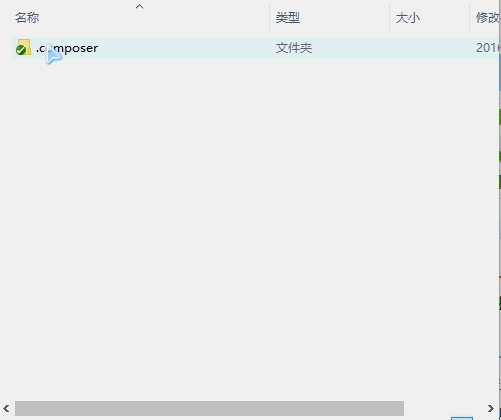

 
## composer#create.bat
+ 创建新的项目
+ 将下载的 ***.composer-help*** 放到项目的根目录（或者是新目录
+ 双击 ***composer#create.bat***
+ 在命令行输入项目名，然后文件就会下载到你的根目录（也就是上一级目录上

## composer#install.bat
+ 从项目的根目录读取读取 ***composer.json*** 文件安装依赖库

## composer#config
+ 将全局设置的 **repositories.packagist** 改成 https://packagist.phpcomposer.com   

## composer#update.bat
+ 更新安装依赖库

# 可能会遇到的问题

### 找不到PHP：
+ 修改 ***run.bat*** 文件

###  如果执行期间出现如下错误：
No supported encrypter found. The cipher and / or key length are invalid.
+ 创建项目的时候没用成功执行 composer.json.scripts.post-create-project-cmd 
+ 需要手动执行一次 ***key#gen.bat*** 生成APP_KEY

### 如果执行期间出现如下错误：
PHP Fatal error:  Uncaught TypeError: Argument 1 passed to App\Exceptions\Handler::report() 
+ 有可能是因为依赖库的版本错误
+ 建议重新执行一次 ***composer#install.bat*** 更新依赖库
+ 检测当前php版本是否>=7.0 如果是请更换其他版本